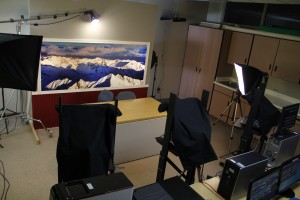
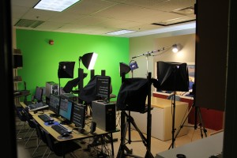

+++
title = "8th Grade Broadcast Journalism"
categories = ["broadcast"]
+++

## Quick Links

[Broadcast Calendar]()

[Broadcast Class Form](https://drive.google.com/file/d/0B0BVrD_GtJgxc2stRFlCRkJDX00/view?usp=sharing)

[Current Broadcast Assignments]()

[Script for the Studio](https://docs.google.com/document/d/1rjv0am9vdmJZP1DYAC0AQwLMOfw6rfnENa_2If4fLU0/edit?usp=sharing)

&nbsp;

&nbsp;

The Talon is the daily news broadcast of the students at Eagleview Middle School. 
It is a student run broadcast. Students perform all the duties from running the cameras and sound board to being anchors. 

Broadcasts are filmed during the morning and aired to the school in the afternoon.

&nbsp;

Students are on a rotation through the news studio.  On days that they are not in the studio, students create feature stories showcasing the events and activities at Eagleview.  They may do a feature on clubs, sports, students, staff or any other noteworthy topic.  

The class is designed to be fun yet practical.  Students serve the school and community by sharing information while at the same time getting hands on practice in a studio setting.  

While we don't claim to be professionals, we do our best to provide a quality presentation each day.

&nbsp;

---

> In case you haven't found the answer for your question please feel free to [ contact me ]().
